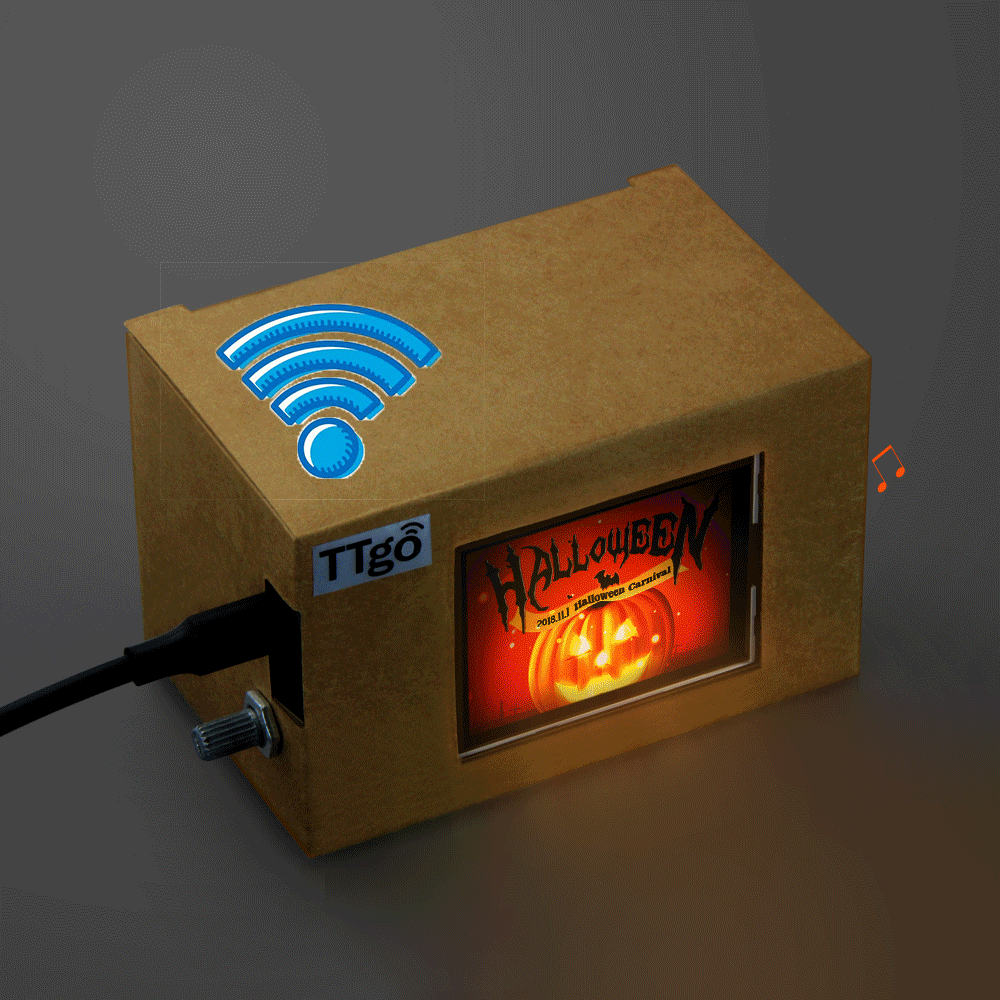
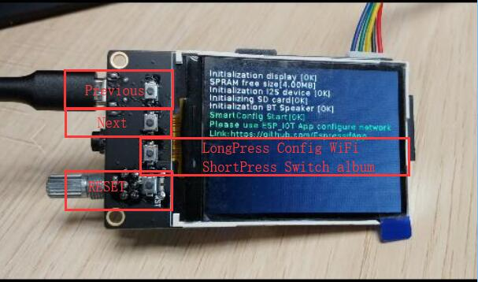
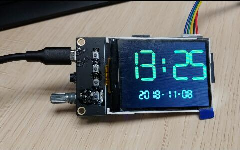
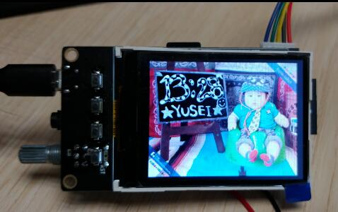

TTGO Time Music box 
======================

# Key features
* Time Atlas: 
Get a picture from the [BIJINT](http://www.bijint.com/model/) website every minute as a display of time, if it fails, display the local font time style

* Album: 
Press the button next to the board reset button to display the changes as a local SD card picture. Note: the picture size will be limited. If the image is too large, it will not be displayed, or the zoom will be incomplete.

* Bluetooth speaker:
Open the phone Bluetooth can search for "TTGO-BT-SPEAKER", you can play music when connected

# Important
- SD card must be used to use the atlas
- Use IDF Version : `esp-idf-v3.1-rc1` --> `Hash:53509c`
- First time use your need configure WiFi SSID and password by IOTespressif App

# Pins Map
| Pin | Function      |
| --- | ------------- |
| 21  | PCM5102 Mute  |
| 22  | I2S DOUT      |
| 25  | I2S LRCK      |
| 26  | I2S BCK       |
| 19  | TFT MOSI      |
| 18  | TFT SCLK      |
| 5   | TFT CS        |
| 23  | TFT DC        |
| 27  | TFT BACKLIGHT |
| 15  | SD CMD        |
| 2   | SD D0         |
| 4   | SD D1         |
| 12  | SD D2         |
| 13  | SD D3         |

# Button Map
| Pin  | Function     | Method     |
| ---- | ------------ | ---------- |
| None | Reset        | Perss      |
| 39   | Switch album | Perss      |
| 39   | Config WiFi  | Long Perss |
| 34   | Next         | Perss      |
| 36   | Previous     | Perss      |

# Acknowledgement
- [loboris](https://github.com/loboris)